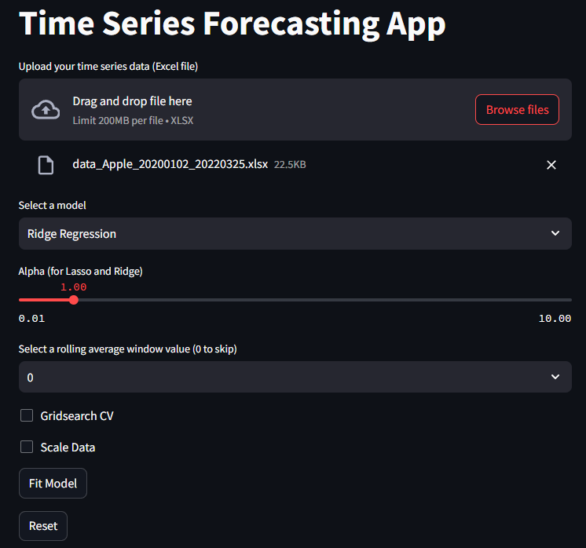
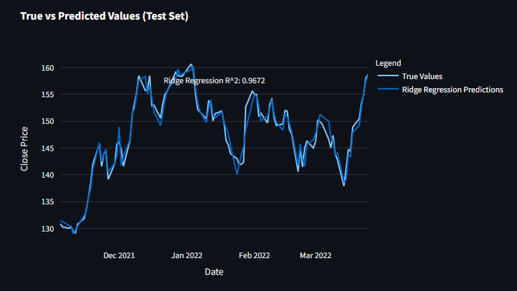

# Financial Data Forecasting

This project aims to provide a comprehensive solution for forecasting financial data using various methods. The implementation includes several improvements to enhance performance, scalability, and usability. A Dockerfile has been added to containerize the application, enabling fast and easy scaling.

## Table of Contents
1. [Usage](#usage)
2. [Improvements](#improvements)
3. [Code Structure](#code-structure)
4. [Running the Application](#running-the-application)

## Usage

The primary use of this project is to forecast the closing prices of financial data, specifically using historical data for Apple. The application allows for the use of different forecasting methods, including simple n-1 prediction and more advanced regression techniques such as Ridge and Lasso regression.

### Features
- **N-1 Prediction**: A naive prediction method using the previous day's closing price. Score: 0.868
- **Ridge Regression**: A regression method that penalizes the size of the coefficients to prevent overfitting. Best params: alpha=0.01, rolling_window=0 -- Score: 0.967 
- **Lasso Regression**: Similar to Ridge, but also performs feature selection by shrinking some coefficients to zero. Score: 0.9380

### Running Predictions
1. **Upload Data**: Upload your time series data in Excel format.
2. **Select Model**: Choose from N-1 Prediction, Ridge Regression, or Lasso Regression.
3. **Tune Hyperparameters**: Optionally, tune hyperparameters for Ridge or Lasso regression.
4. **Fit Model**: Fit the selected model to the data.
5. **Plot Results**: Visualize the true vs. predicted values.
6. **Note**: If adding or removing rolling windows, be sure to reset the model and data (since the features change in dimensions)




The image above shows the interface of the Time Series Forecasting App. Users can upload data, select models, and visualize the results using this intuitive interface.


## Improvements

Several improvements have been made to the original code to enhance its functionality and performance:

0. **Data Upload**:
   - Allow users to select their own datafile. (Enables flexibility in data usage.)

1. **Data Handling**:
   - Missing values are now handled using forward and backward fill methods. (Ensures data continuity.)
   - Training and test sets are resettable to maintain data integrity during multiple operations. (Prevents data contamination.)

2. **Scaling**:
   - Added Data scaling. (Could improve model performance.)
   - A `StandardScaler` can be used to standardize features before training. (Ensures feature comparability.)

3. **Feature Engineering**:
   - Rolling average features can be added to capture trends over specified windows. (Could enhance model accuracy.)

4. **Modular Design**:
   - The codebase has been modularized with an abstract base class for forecasting templates. (Facilitates code maintainability.)
   - Separate classes for each model type allow for easy extension and maintenance. (Promotes scalability.)

5. **Hyperparameter Tuning**:
   - Grid search with cross-validation is implemented for hyperparameter tuning. (Optimizes model performance.)
   - The best hyperparameters are selected based on R^2 score. (Ensures robust model selection.)

6. **Plotting and Visualization**:
   - A Plotly-based interactive plotting system is integrated with Streamlit for visualizing predictions. (Mainly for user experience.)



## Code Structure

- **`src.forecaster.py`**: Contains the core logic for forecasting models, including an abstract base class and specific model implementations. (Centralizes model logic.)
- **`src.plotter.py`**: Handles the plotting and visualization using Plotly to create interactive plots. (Provides visualization tools.)
- **`main.py`**: Manages the Streamlit interface, user interactions, and integrates forecasting and plotting functionalities. (Coordinates the application workflow.)
- **`data/`**: Directory to store the uploaded time series data files. (Organizes data storage.)


## Running the Application

**Build the Docker Image**:
    ```sh
    docker-compose up --build
    ```


Once the Docker container is running, open your web browser and navigate to `http://localhost:8501`. You will see the Time Series Forecasting App interface, where you can upload data, select models, and visualize results.
